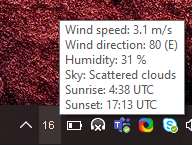

# py-openweather-tray

System tray app for written in Python that shows outside temperature in given city 
using data from openweathermap.org. 
Color of text is changing based on the temperature.
Supports both Celsius and Fahrenheit scale.

Tooltip contains additional weather info (wind speed, direction, sunrise, sunset, etc.)

Screenshot:

## Motivation

I wanted to compare very similar application that I wrote in Clojure (clj-openweather-tray) with this one.

## Findings
I must say that even though I like to write code in Clojure, it took me longer to write clj-openweather-tray app
and Python code is much more readable.

16 pixels, which is the size of tray icon on Windows OS, is not much if you want to fit 3 or 4 chars inside and still
be able to read it :)

## Build

This project is using [fbs](https://github.com/mherrmann/fbs-tutorial).

Create a virtual environment in the current directory:

    python3 -m venv venv

Activate the virtual environment:

    # On Mac/Linux:
    source venv/bin/activate
    # On Windows:
    call venv\scripts\activate.bat
    # On Windows in PowerShell
    .\venv\scripts\activate.ps1

The remainder of the tutorial assumes that the virtual environment is active.

Install the required libraries:

    pip install -r requirements.txt

(If this produces errors, try `pip install wheel` first.)

## Run the app

    fbs run
   
## Installation

See [fbs tutorial](https://github.com/mherrmann/fbs-tutorial).

## License

Copyright © 2020 Miroslav Havrlent

This program and the accompanying materials are made available under the
terms of the Eclipse Public License 2.0 which is available at
http://www.eclipse.org/legal/epl-2.0.

This Source Code may also be made available under the following Secondary
Licenses when the conditions for such availability set forth in the Eclipse
Public License, v. 2.0 are satisfied: GNU General Public License as published by
the Free Software Foundation, either version 2 of the License, or (at your
option) any later version, with the GNU Classpath Exception which is available
at https://www.gnu.org/software/classpath/license.html.
